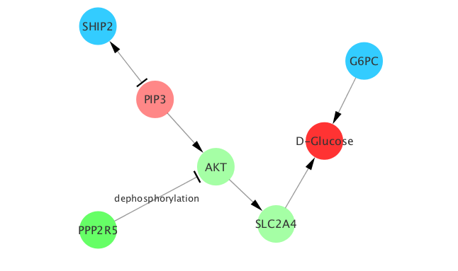

```{r setup, echo=FALSE}
knitr::opts_chunk$set(message=FALSE, fig.path='figures/')
```

<!-- Title block --> 
<br>
<p style="text-align:center;font-size:200%;color:Red"> MetaboSignal </p>
<p style="text-align:center;font-size:90%;color:Gray"> Andrea Rodriguez Martinez, 
Rafael Ayala, Joram M. Posma, Ana L. Neves, Marc-Emmanuel Dumas </p>
<p style="text-align:center;font-size:90%;color:Gray"> May 25, 2017 </p>
<br>

# Abstract
<p style="font-size:110%">"MetaboSignal" is an R package designed to overlay metabolic and signaling pathways reported in the Kyoto Encyclopedia of Genes and Genomes (KEGG). It is a network-based approach that allows exploring the topological relationship between genes (signaling- or metabolic-genes) and metabolites. MetaboSignal is ideally suited to identify biologically relevant candidate genes in metabolomics quantitative trait locus (mQTL) mapping studies, especially in the case of *trans*-acting associations. It can be also used to provide mechanistic explanations of the metabolic perturbations observed in genetic modes (e.g. knock-out) or to identify target metabolic pathways of signaling genes. <br><br> </p>

# Introduction

<p style="font-size:110%">The Kyoto Encyclopedia of Genes and Genomes (KEGG) [@kanehisa2000] is the reference database to explore biochemical pathways and cellular processes. KEGG pathways are stored and displayed as graphical diagrams composed by nodes (e.g. metabolites, genes, reactions) and edges, which represent the physical interaction (e.g. metabolic reaction, activaction, or binding) between pairs of nodes. </p>

<p style="font-size:110%">In the last years, various tools have been developed for analyzing and customizing metabolic or signaling KEGG graphs independently [@zhang2009; @posma2014]. However, these approaches ignore the interconnection between the genome and the metabolome, and consequently they cannot provide an integrated overview of regulatory events leading to the observed metabolic patterns. In order to address this problem, we have developed an R-based toolbox, called MetaboSignal, that allows building organism-specific KEGG metabolic and signaling networks that account for the interaction between metabolites and genes (both metabolic and signaling). Importantly, our approach allows creating tissue-specific networks, where genes undetected in a given target tissue are neglected. 
<br><br>  </p>

# Software features

<p style="font-size:110%">The metabolic and signaling KEGG pathways of interest are parsed using the KEGGgraph package [@zhang2009], to generate organism-specific metabolic and signaling directed network-tables (i.e. 3-column matrix). The user can decide whether gene nodes will represent organism-specific KEGG gene IDs or orthology IDs. Importantly, in the case of human, MetaboSignal allows building tissue-specific signaling networks, where genes not expressed in a given target tissue are neglected. Tissue filtering is achieved using the hpar package [@gattohpar], which is based on data from the Human Protein Atlas database.</p>

<p style="font-size:110%">The metabolic and signaling networks are then merged to build a MetaboSignal network, which can be further customized according to different criteria. For instance, undesired nodes can be removed or nodes representing chemical isomers of the same compound can be clustered into a common node. MetaboSignal evaluates network topology (e.g. node betweeness) and calculates a distance matrix [@csardi2006igraph] containing the shortest path lengths from a list of genes to a list of metabolites of interest. MetaboSignal also builds subnetworks containing betweenness-ranked shortest paths from a list of genes to a list of metabolites (presumably selected based on the distance matrix).</p>

<p style="font-size:110%">Finally, the original network or the sub-networks are exported to be visualized in CytoScape [@shannon2003]. MetaboSignal also generates several attribute files that allow customization of the node parameters. Alternatively, the network can be transformed into an igraph object and visualized in R. 
<br><br> </p>

# Example

<p style="font-size:110%">In order to illustrate the functionality of our package, we have used transcriptomic and metabonomic datasets from white adipose tissue of rat congenic strains derived from the diabetic Goto-Kakizaki (GK) and normoglycemic Brown-Norway (BN) rats. Despite of the strong genetic similarities between the congenic strains, each strain exhibits distinctive metabolic and gene expression patterns. </p>

<p style="font-size:110%">We next describe how MetaboSignal was used to provide a mechanistic explanation of the gene-metabolite associations found in this study. As an example, we will use the associations between the genes: *G6pc3* (303565), *Ship2* (65038) or *Ppp2r5b* (309179) and D-glucose.
<br><br> </p>

## Define input data

<p style="font-size:110%">We built a rat-specific MetaboSignal network by merging two metabolic pathways: "glycolysis"  and "inositol phosphate metabolism", with two signaling pathways: "insulin signaling pathway" and "PI3K-Akt signaling pathway".</p>

<p style="font-size:110%">We used the function "MS_keggFinder( )" to find the "organism_code" of the rat and the IDs of the pathways of interest. Notice that the IDs of all metabolic and signaling pathways of a given organism can be retrieved by calling the function "MS_getPathIds()".</p>

```{r include = FALSE}
library(MetaboSignal)
```

```{r, message = FALSE, tidy = TRUE}
MS_keggFinder(KEGG_database="organism", match = "rattus")
```

```{r tidy = TRUE, tidy.opts=list(indent = 4, width.cutoff = 50)}
MS_keggFinder(KEGG_database ="pathway", match = c("glycol", "inositol phosphate","insulin signal", "akt"), organism_code = "rno")
```

<p style="font-size:110%"> Based on this, </p>

```{r tidy = TRUE}
metabo_paths <- c("rno00010","rno00562")
signaling_paths <- c("rno04910", "rno04151")
```
<br>

## Build MetaboSignal network-table

<p style="font-size:110%">We used the selected metabo_paths and signaling_paths to build a MetaboSignal network-table. </p>

```{r tidy = TRUE, tidy.opts=list(indent = 4, width.cutoff = 50), results='asis',eval=FALSE}
MetaboSignal_table <- MS_keggNetwork(metabo_paths = metabo_paths, 
                                     signaling_paths = signaling_paths)

```

<p style="font-size:110%">MetaboSignal_table is a three-column matrix where each row represents an edge between two nodes (source to target). The third column indicates the type of interaction. Since we did not use the option "expand_genes", the gene nodes of the network represent orthology KEGG IDs. Note that clustering gene-isoforms by orthology IDs is a very convenient strategy to reduce network dimensionality without losing biological information.  </p>
<br>

## Customize MetaboSignal network-table

<p style="font-size:110%">Given that we were not interest in discriminating between different isomers of D-glucose, we used the function "MS_replaceNodes( )" to group the IDs of alpha-D-glucose ("cpd:C00267"), beta-D-glucose ("cpd:C00221") and D-glucose ("cpd:C00031").</p>

```{r tidy = TRUE, tidy.opts=list(indent = 4, width.cutoff = 50)}
MetaboSignal_table <- MS_replaceNode(node1 = c("cpd:C00267", "cpd:C00221"), 
                                     node2 = "cpd:C00031", MetaboSignal_table)
```

<p style="font-size:110%">We used the function "MS_findMappedNodes( )" to check that the glucose isomers had been successfully clustered.</p>

```{r tidy = TRUE, tidy.opts=list(indent = 4, width.cutoff = 50), message = FALSE}
MS_findMappedNodes(nodes = c("cpd:C00267", "cpd:C00221", "cpd:C00031"),
                   MetaboSignal_table)
```
<br>

## Build distance matrix

<p style="font-size:110%">We used the function "MetaboSignal_distances( )" to calculate the shortest path lengths from our genes of interest: *G6pc3* (303565), *Ship2* (65038) or *Ppp2r5b* (309179) to D-glucose ("cpd:C00031"). We used the default mode (mode = "SP"), which indicates that all the network is considered as directed, except the edges linked to the target metabolite (in this case D-glucose) that are considered as undirected. This option is designed to reach metabolites acting as substrates of irreversible reactions, while keeping the directionality of the network.</p>


```{r tidy = TRUE, tidy.opts=list(indent = 4, width.cutoff = 50), message = FALSE}
## Get KEGG IDs
MS_convertGene(genes = c("303565", "65038", "309179"), organism_code = "rno", organism_name = "rat", output = "matrix")
MS_distances(MetaboSignal_table, organism_code = "rno", 
             source_genes = c("K01084", "K15909", "K11584"), 
             target_metabolites = "cpd:C00031", names = TRUE)
```
<br>

## Build shortest-paths subnetwork

<p style="font-size:110%">Finally, we used the function "MetaboSignal_shortestPathsNetwork( )" to build a subnetwork containing betweenness-ranked shortest paths from our genes of interest: *G6pc3* (303565), *Ship2* (65038) or *Ppp2r5b* (309179) to D-glucose ("cpd:C00031").</p>

```{r tidy = TRUE, tidy.opts=list(indent = 4, width.cutoff = 50), eval = FALSE }
MS_shortestPathsNetwork(MetaboSignal_table, organism_code="rno",
                        source_nodes = c("K01084", "K15909", "K11584"), 
                        target_nodes = "cpd:C00031", type = "bw", 
                        file_name = "MS")
```
<br>
<p style="font-size:110%">This function exported three files in the working directory: "MS_Network.txt",
"MS_NodesType.txt", and "MS_TargetNodes.txt". These files were imported into cytoscape using the options: 
file-import-network and file-import-table. The attribute files were used to customize the network 
(e.g. the nodes were coloured based on the molecular entity they represent), producing a final graph that 
looks as follows:</p>




# References


